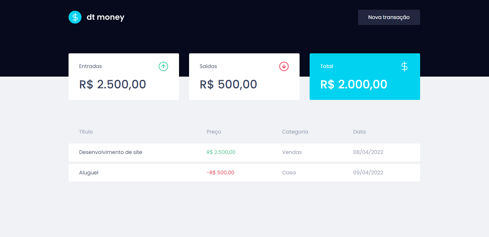

  

 

<h4 align="center"><a href="https://dtmoney-sampaiocode.vercel.app">Clique para visitar o projeto</a></h4>

---

## 💻 Sobre o projeto

Projeto desenvolvido durante o Chapter II do Ignite trilha de ReactJS da [Rocketseat](https://www.rocketseat.com.br/). Esse projeto tem o objetivo de facilitar o gerenciamento de finanças pessoais, permitindo o usuário cadastrar novas transações e monitorar as mesmas organizadas em categorias.

## 🛠️ Tecnologias utilizadas

Este projeto foi desenvolvido utilizando as seguintes tecnologias:

- [ReactJS](https://reactjs.org/)
- [TypeScript](https://www.typescriptlang.org/)
- [Styled Components](https://styled-components.com/)
- [Axios](https://github.com/axios/axios)
- [MirajeJS](https://miragejs.com/)
  
---

Desenvolvido com 💙 por [Deivit Eduardo](https://github.com/sampaiocode)
